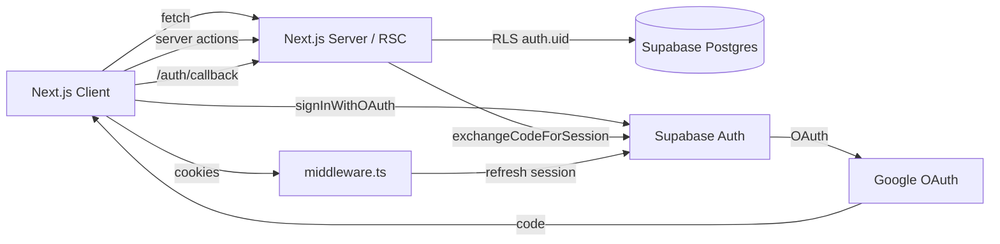
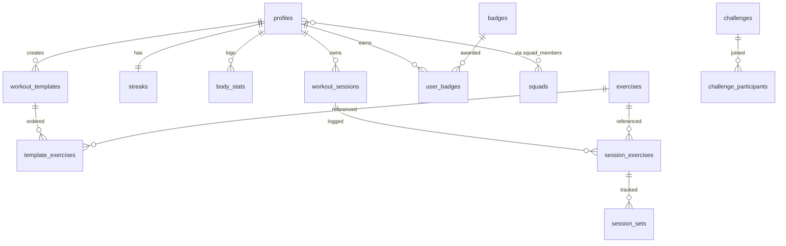

<div align="center">

# IRON TRACK

**Brutalist fitness tracker. No weakness.**

Curated splits, custom workout builder, progressive overload, body analytics,
streaks, and live leaderboards — built on Next.js 15 + Supabase.

[Quickstart](./QUICKSTART.md) · [Database schema](./supabase/migrations) · [Designs](./frontend%20design%20html)

</div>

---

## Features

### Workout tracking
- **Predefined workouts** — Push/Pull/Legs, Bro Split, Full Body Heavy. Tap and start.
- **Custom workout builder** — drag-and-drop exercises, set/rep/rest targets, multi-day plans.
- **Progressive overload log** — every set saves to Supabase; an `suggest_overload` RPC reads your last best set and tells you exactly what to lift next (auto-handles `kg` vs `lb`).
- **Exercise library** — ~870 exercises with images and instructions, seeded from the open-source [`free-exercise-db`](https://github.com/yuhonas/free-exercise-db). Custom exercises are RLS-scoped to the creator.

### Progress & analytics
- **Volume heatmap** — month grid colored by total daily volume.
- **Streaks & freeze tokens** — `recompute_streak()` auto-consumes a freeze token to absorb 1-day rest gaps when available.
- **Body stats log** — weight, body fat, measurements (jsonb). Multi-axis trend chart via Recharts.
- **Achievements & badges** — first workout, 7/30-day streaks, 10K/100K volume tiers. Awarded by the `finish_session()` RPC at session close.

### Social & ranking
- **Global leaderboard** — anon-callable `get_public_top5()` exposes the top 5; ranks 6+ are gated behind auth via `get_full_leaderboard()` (matches the design's "LOGIN TO SEE MORE" CTA exactly).
- **Squads** — create or join via 8-char invite code. `get_squad_leaderboard()` is a SECURITY DEFINER function that verifies membership before returning data.
- **Challenges** — weekly directives (volume/sessions/streak/reps). Auto-progress on `finish_session()`.

---

## Tech stack

| Layer | Choice |
|---|---|
| Frontend | Next.js 15 (App Router), React 19, TypeScript, Tailwind CSS |
| Backend | Supabase (Postgres + RLS + Auth + Storage) |
| Auth | Email/password + Google OAuth via `@supabase/ssr` |
| DnD | `@dnd-kit/core` + `@dnd-kit/sortable` (custom workout builder) |
| Charts | `recharts` (body-stats trends) |
| Seeds | `free-exercise-db` (MIT) |

The visual design system (Crimson Fury, brutalist dark mode) lives in [`frontend design html/crimson_fury/DESIGN.md`](./frontend%20design%20html/crimson_fury/DESIGN.md). Tokens are mirrored in [`tailwind.config.ts`](./tailwind.config.ts).

---

## Architecture





---

## Repo layout

```
silver-happiness/
├── README.md, QUICKSTART.md, .gitignore, .env.example
├── frontend design html/        ← original design references
├── supabase/
│   ├── migrations/
│   │   ├── 0001_schema.sql      ← tables + curated plans + base badges
│   │   ├── 0002_rls.sql         ← Row-Level Security policies
│   │   └── 0003_functions_triggers.sql
│   └── seed/
│       └── sample_challenges.sql
├── scripts/seed-exercises.ts    ← loads free-exercise-db via service role
└── src/
    ├── middleware.ts
    ├── app/
    │   ├── page.tsx                          ← landing (home_crimson_fury)
    │   ├── (auth)/{login,signup}/page.tsx    ← authentication design
    │   ├── auth/callback/route.ts            ← OAuth code exchange
    │   ├── compete/page.tsx                  ← public leaderboard (top 5 + login wall)
    │   └── (app)/                            ← authed shell with sidebar
    │       ├── layout.tsx
    │       ├── workouts/{,builder,sessions/[id]}/page.tsx
    │       ├── exercises/page.tsx
    │       ├── analytics/page.tsx
    │       ├── squads/{,[id]}/page.tsx
    │       └── settings/page.tsx
    ├── components/
    │   ├── ui/         (Icon, primitives)
    │   ├── layout/     (Sidebar, TopBar, BottomNav, Footer)
    │   ├── auth/       (AuthForm)
    │   ├── workouts/   (WorkoutBuilder, ActiveWorkout)
    │   ├── exercises/  (ExerciseLibrary)
    │   ├── analytics/  (StreakCard, Heatmap, BodyStatsPanel, BadgeGrid)
    │   ├── social/     (LeaderboardClient, ChallengeList, SquadActions, LeaveSquadButton)
    │   └── settings/   (SettingsForm)
    ├── lib/
    │   ├── supabase/{client,server,middleware}.ts
    │   ├── auth.ts, profile.ts, workouts.ts, exercises.ts,
    │   ├── analytics.ts, social.ts
    └── types/database.ts
```

---

## Server-enforced rules (where the security lives)

- **Top 5 public, rest after login** — `get_public_top5()` is granted to `anon`; `get_full_leaderboard()` raises if `auth.uid()` is null. The compete page imports both; ranks 6+ never reach the client without a session.
- **Custom exercises** — `INSERT` policy requires `is_custom = true AND created_by = auth.uid()`, so users can't pollute or overwrite the curated library.
- **Workouts/sets** — every session/exercise/set query uses an `EXISTS` chain back to `workout_sessions.user_id = auth.uid()`; impossible to read or write someone else's logs.
- **Squads** — readable only by members. `get_squad_leaderboard()` re-verifies membership before returning rows.
- **finish_session()** — runs as `SECURITY DEFINER` to atomically: mark finished → recompute streak (consumes freeze tokens) → evaluate badge tiers → update active challenge progress.

---

## Out of scope (not built; easy add-ons)

- Native mobile app — the design is responsive web; PWA hooks possible later.
- Real-time leaderboard push — server reads on each request; can layer Supabase Realtime later.
- Payments / coaching marketplace.
- AI form-check from camera — would slot into the active workout log.

---

## License

Source code: MIT. Exercise dataset (`free-exercise-db`): MIT (separate copyright). Design tokens authored for this project.
