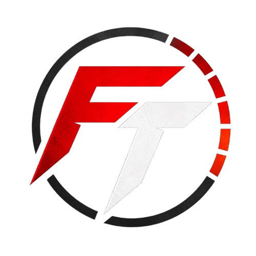
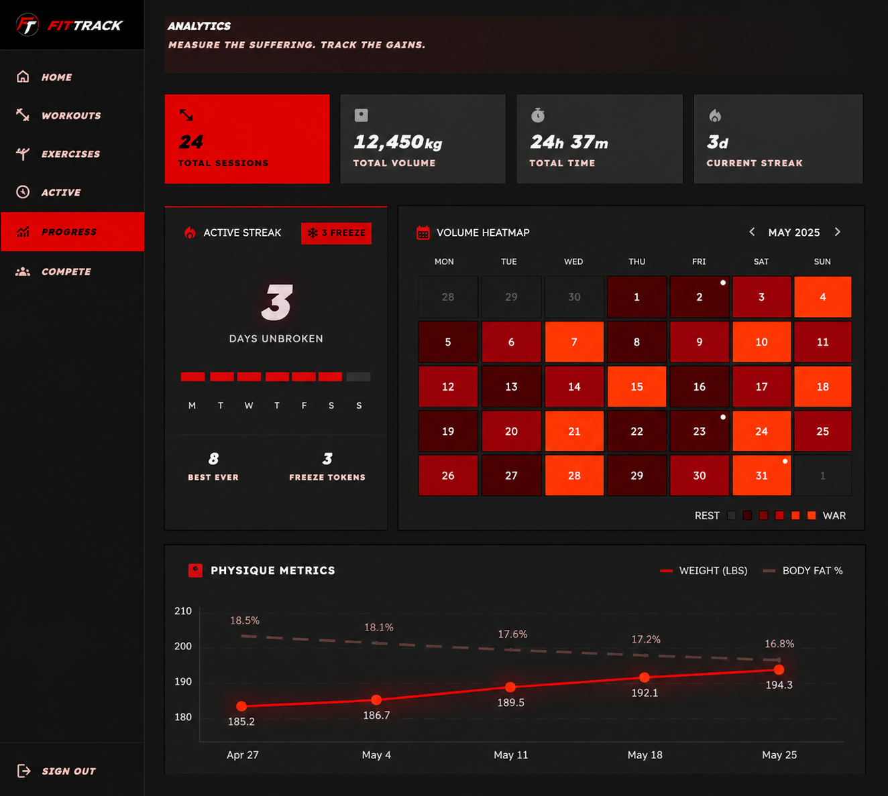
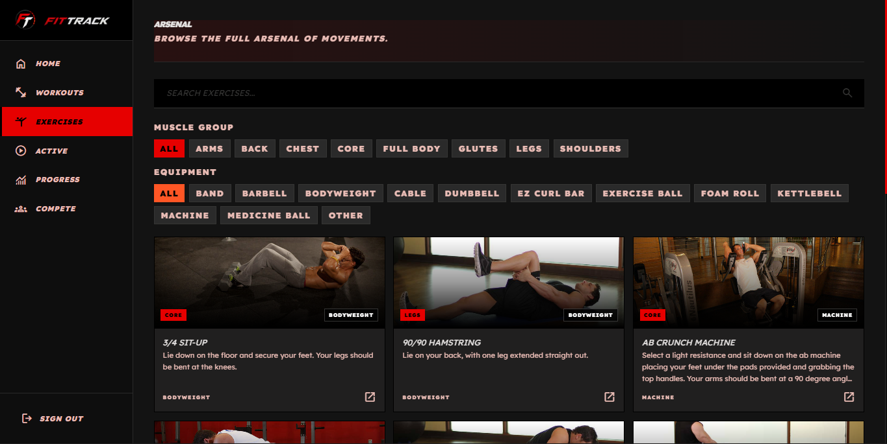
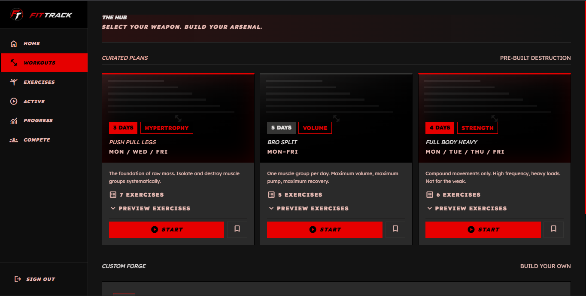
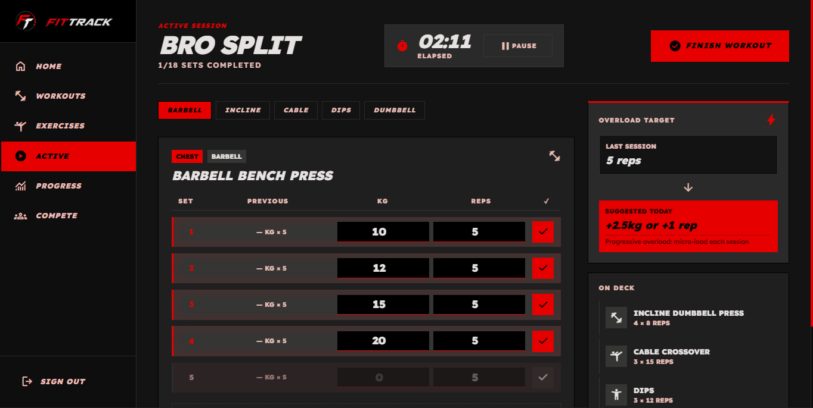
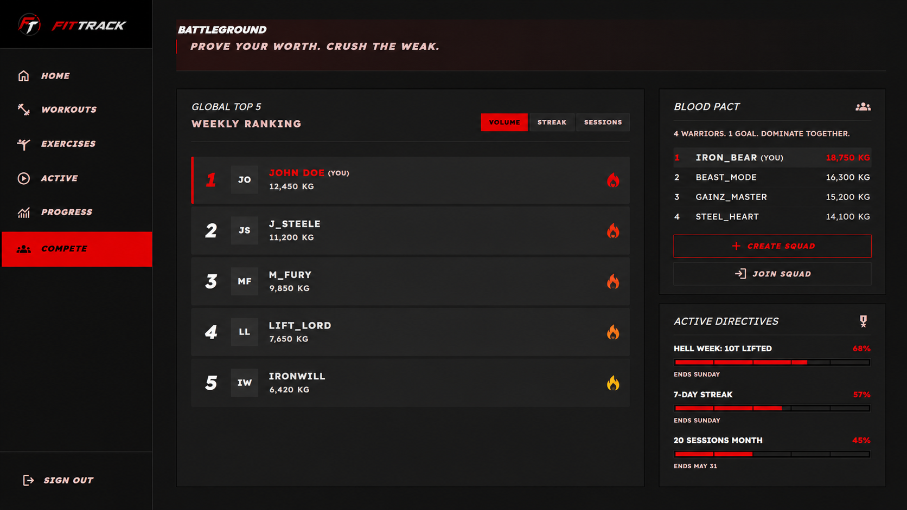
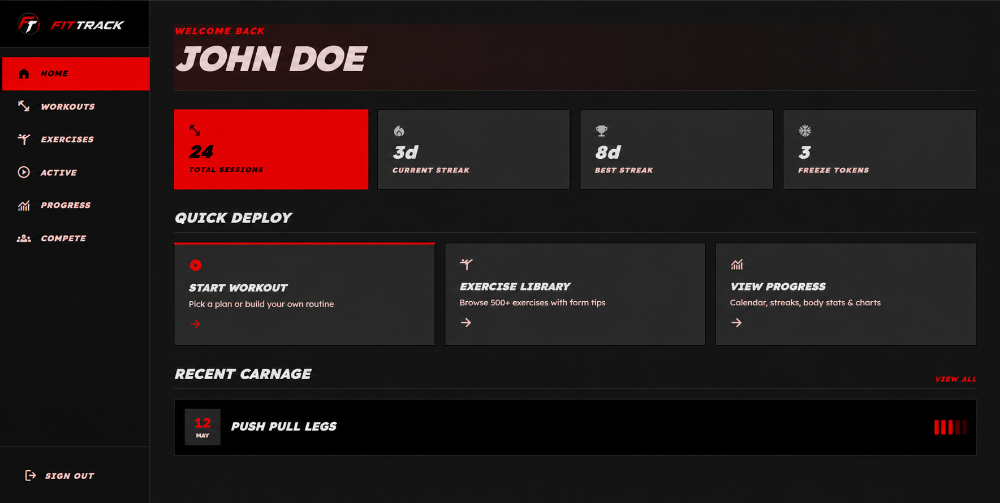
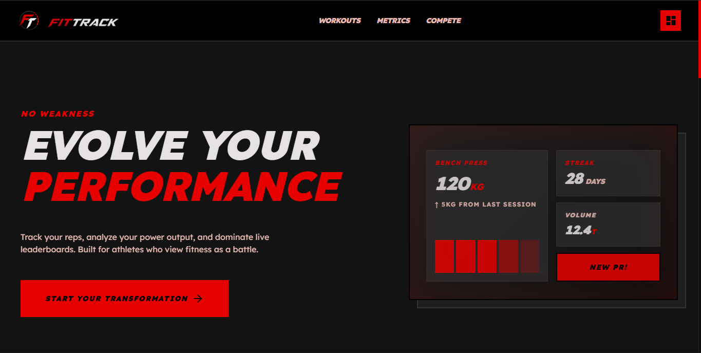
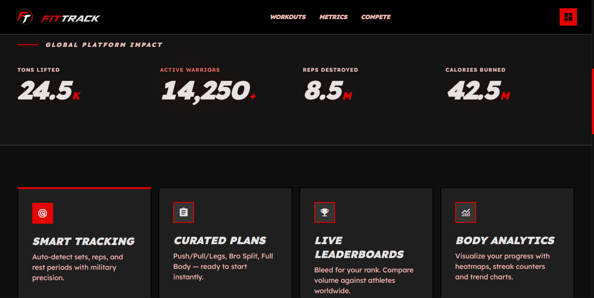

  <h1> FitTrack</h1>
  
<strong>The Ultimate Fitness Tracking & Workout Management Platform</strong>

  
  
  
  

## 📖 About FitTrack

Most fitness enthusiasts still rely on fragmented notes apps, spreadsheets, or overly complex apps to track their gym progress. 

**FitTrack** is a premium, highly optimized application designed to standardize and elevate how you track your fitness journey. It provides a comprehensive ecosystem for workout creation, active workout logging, exercise library management, and competitive social features. Whether you're a beginner or an elite athlete, FitTrack offers the tools you need to crush your fitness goals without the friction of traditional tracking methods.

## 🚀 Features

- **Massive Exercise Library**: Access a huge dataset of **861+ workout exercises** with detailed variations and tracking support.
- **Workout Builder & Plans**: Create and manage custom workout routines tailored to your specific needs.
- **Active Workout Logging**: Track sets, reps, and weights during a live session.
- **Progress Analytics**: Beautiful, interactive charts using Recharts to visualize your fitness journey and gains.
- **Social Leaderboard**: Share your progress, compete with others, and stay motivated.

## 📸 Screenshots

<table>
  <tr>
    <td align="center" colspan="2">
      <strong>Progress Analytics</strong> 
      
    </td>
  </tr>
  <tr>
    <td align="center" colspan="2">
      <strong>Exercises Library (861+ Exercises)</strong> 
      
    </td>
  </tr>
  <tr>
    <td align="center">
      <strong>Workout Creation</strong> 
      
    </td>
    <td align="center">
      <strong>Active Session</strong> 
      
    </td>
  </tr>
  <tr>
    <td align="center" colspan="2">
      <strong>Compete & Leaderboard</strong> 
      
    </td>
  </tr>
  <tr>
    <td align="center" colspan="2">
      <strong>Dashboard Homepage</strong> 
      
    </td>
  </tr>
  <tr>
    <td align="center">
      <strong>FitTrack Homepage</strong> 
      
    </td>
    <td align="center">
      <strong>Homepage Metrics</strong> 
      
    </td>
  </tr>
</table>

## 🏗️ Repository Layout (top-level)

- `src/app/` — Next.js app routes and pages
- `src/components/` — React components
- `src/lib/` — App logic, actions and helpers
- `supabase/` — Database schema and migrations
- `public/` — Static assets

## 🔗 Quick Links

- [Quickstart Guide](QUICKSTART.md) — Learn how to set up the project locally.
- [Contributing Guidelines](CONTRIBUTING.md) — Learn how to contribute to this project.
- [Design Details](front%20end%20design/crimson_fury/DESIGN.md) — Read more about our design philosophy.
- [License](LICENSE) — MIT License (open source, anyone can use, feel free).

## 🛠️ Tech Stack

- **Framework**: Next.js 16 (App Router)
- **Library**: React 19
- **Language**: TypeScript
- **Styling**: Tailwind CSS v4
- **Database & Auth**: Supabase
- **Bot Protection**: Cloudflare Turnstile on login and support submissions
- **Charts**: Recharts

## 🏁 Getting Started

Check out the [QUICKSTART.md](QUICKSTART.md) file for comprehensive setup instructions, including installing dependencies, setting up Supabase, and starting the local development server.

## 🚀 Deployment

This project deploys easily to Vercel or any platform that supports Next.js. Simply link your repository and ensure your environment variables (like Supabase URLs and keys) are set in your platform's configuration dashboard.

## 🤝 Where to Start Working

- **UI Components**: `src/components/`
- **Pages / Routes**: `src/app/`
- **Shared Code / API Logic**: `src/lib/`

To contribute, check out [CONTRIBUTING.md](CONTRIBUTING.md). We welcome community pull requests!
